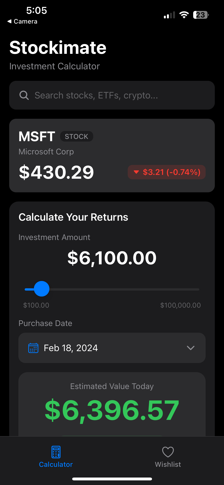
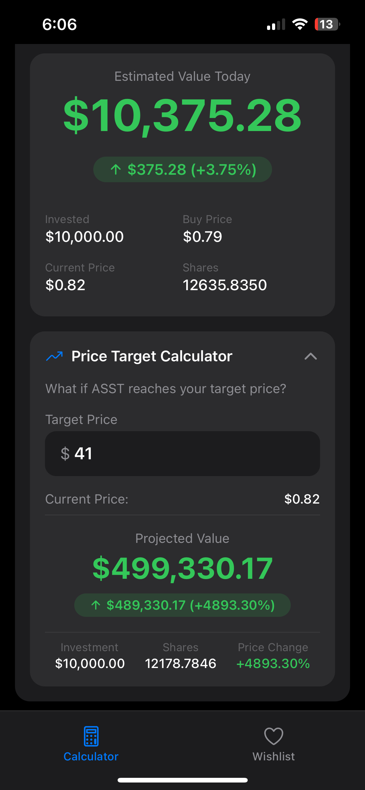
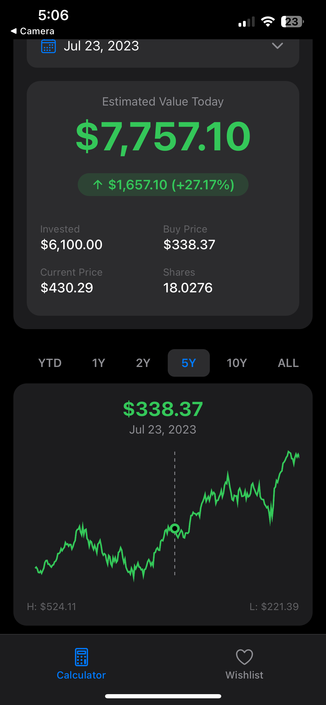

# Stockimate - Investment Calculator

A beautiful, modern mobile application for calculating investment returns and tracking stocks. Built with React Native and Expo, Stockimate helps you visualize potential returns on your investments with real-time data and interactive charts.

## 📱 Preview

### Calculator Screen
The main calculator screen allows you to search for stocks, set investment amounts, and calculate potential returns. Search for any stock, ETF, or cryptocurrency and see real-time pricing information.

<div align="center">
  
</div>

### Investment Details & Returns
View detailed investment information including estimated value today, daily changes, and key metrics like invested amount, current price, buy price, and number of shares. The Price Target Calculator lets you see projected returns at any target price.

<div align="center">
  
</div>

### Interactive Chart with Historical Data
Explore historical price data with an interactive chart that supports multiple timeframes (YTD, 1Y, 2Y, 5Y, 10Y, ALL). Drag on the chart to select different purchase dates and see how your investment would have performed. The chart displays high/low prices and marks your purchase date.

<div align="center">
  
</div>

### Wishlist
Track your favorite stocks, ETFs, and cryptocurrencies in a personalized wishlist. See real-time prices, daily changes, and mini charts for each tracked asset. Tap any item to quickly calculate returns.

<div align="center">
  
</div>

## ✨ Features

### 🧮 Investment Calculator
- **Real-time Stock Quotes**: Get up-to-date prices using Finnhub API
- **Historical Price Data**: Access historical prices from Yahoo Finance
- **Investment Amount Slider**: Easily adjust investment amounts from $100 to $100,000
- **Purchase Date Picker**: Select any purchase date to calculate returns
- **Profit/Loss Display**: See your estimated value, gains, and percentage returns
- **Price Target Calculator**: Calculate projected returns at target prices

### 📊 Interactive Charts
- **Multiple Timeframes**: View data for YTD, 1Y, 2Y, 5Y, 10Y, or ALL
- **Chart Scrubbing**: Drag on the chart to select different purchase dates
- **Visual Price Indicators**: See high/low prices and purchase price markers
- **Smooth Animations**: Beautiful, performant chart rendering with react-native-wagmi-charts

### ⭐ Wishlist
- **Track Multiple Assets**: Add stocks, ETFs, and cryptocurrencies to your wishlist
- **Real-time Updates**: See current prices and daily changes
- **Quick Access**: Navigate to calculator from wishlist items
- **Persistent Storage**: Your wishlist is saved locally using AsyncStorage

### 🎨 User Experience
- **Dark Mode**: Beautiful dark theme optimized for viewing financial data
- **Smooth Animations**: Polished interactions and transitions
- **Loading States**: Skeleton screens for better perceived performance
- **Error Handling**: Graceful error boundaries and user feedback
- **Responsive Design**: Works seamlessly on iOS and Android

## 🚀 Getting Started

### Prerequisites
- Node.js (v18 or later)
- npm or yarn
- Expo CLI (`npm install -g expo-cli`)
- iOS Simulator (for iOS development) or Android Emulator (for Android development)

### Installation

1. Clone the repository:
```bash
git clone https://github.com/yourusername/stockimate.git
cd stockimate
```

2. Install dependencies:
```bash
npm install
```

3. Start the development server:
```bash
npm start
```

4. Run on your preferred platform:
```bash
# iOS
npm run ios

# Android
npm run android

# Web
npm run web
```

## 🔧 Configuration

### API Keys

The app uses two APIs for stock data:

1. **Finnhub API** - For real-time stock quotes
2. **Yahoo Finance API** - For historical price data

You'll need to configure API keys in `src/services/config.ts`:

```typescript
export const FINNHUB_API_KEY = 'your-finnhub-api-key';
export const YAHOO_FINANCE_API_KEY = 'your-yahoo-finance-api-key';
```

> **Note**: For development, you can use free tier API keys. See the respective API documentation for rate limits.

## 📁 Project Structure

```
stockimate/
├── app/                    # Expo Router app directory
│   ├── (tabs)/            # Tab navigation screens
│   │   ├── index.tsx      # Calculator screen
│   │   └── wishlist.tsx   # Wishlist screen
│   └── _layout.tsx        # Root layout
├── assets/                 # Images, icons, and static assets
├── src/
│   ├── components/        # Reusable UI components
│   │   ├── AmountSlider.tsx
│   │   ├── DatePicker.tsx
│   │   ├── PriceTargetCalculator.tsx
│   │   ├── ProfitDisplay.tsx
│   │   ├── SearchBar.tsx
│   │   ├── StockChart.tsx
│   │   ├── StockInfo.tsx
│   │   ├── TimeFrameSelector.tsx
│   │   └── WishlistItem.tsx
│   ├── constants/         # Theme and styling constants
│   ├── context/         # React Context providers
│   ├── hooks/             # Custom React hooks
│   │   ├── useHistoricalData.ts
│   │   ├── usePurchasePrice.ts
│   │   ├── useStockQuote.ts
│   │   └── useStockSearch.ts
│   ├── services/          # API services
│   │   ├── finnhubApi.ts
│   │   └── yahooFinance.ts
│   ├── types/             # TypeScript type definitions
│   └── utils/             # Utility functions
└── package.json
```

## 🛠️ Tech Stack

- **Framework**: React Native with Expo
- **Navigation**: Expo Router (file-based routing)
- **State Management**: React Context API
- **Charts**: react-native-wagmi-charts
- **Storage**: @react-native-async-storage/async-storage
- **Date Handling**: date-fns
- **Icons**: @expo/vector-icons
- **Language**: TypeScript

## 📱 Supported Platforms

- ✅ iOS
- ✅ Android
- ✅ Web (with limited functionality)

## 🎯 Key Features Explained

### Investment Calculation
The app calculates your investment returns based on:
- **Investment Amount**: The initial amount you invested
- **Purchase Price**: The stock price on your purchase date
- **Current Price**: The real-time current stock price
- **Shares**: Automatically calculated based on investment amount and purchase price

### Price Target Calculator
Set a target price and see:
- Projected value at that price
- Projected profit/loss
- Percentage change from current price
- Number of shares you'd own

### Chart Interaction
- **Scrubbing**: Drag your finger along the chart to see prices at different dates
- **Timeframe Selection**: Switch between different time periods to analyze performance
- **Purchase Marker**: Visual indicator showing your purchase date and price

## 🤝 Contributing

Contributions are welcome! Please feel free to submit a Pull Request.

## 📄 License

This project is licensed under the MIT License.

## 🙏 Acknowledgments

- [Finnhub](https://finnhub.io/) for real-time stock quotes
- [Yahoo Finance](https://finance.yahoo.com/) for historical data
- [Expo](https://expo.dev/) for the amazing development platform
- [React Native Wagmi Charts](https://github.com/coinjar/react-native-wagmi-charts) for beautiful chart components

## 📞 Support

If you encounter any issues or have questions, please open an issue on GitHub.

---

Made with ❤️ using React Native and Expo
